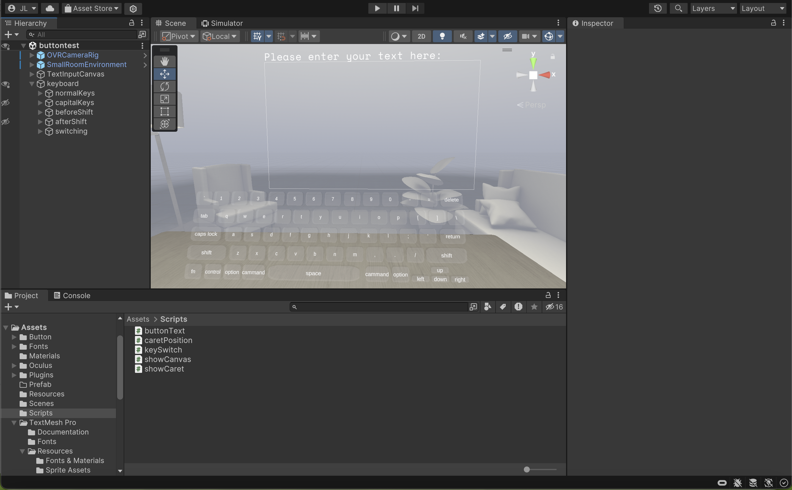

# VR Text Entry Based on Hand Tracking

Jiaying Li and Dr. Yalong Yang collaborated on this side project in the Immersive Visualization & Interaction (IVI) Lab, which is part of the Georgia Tech Visualization (GTVis) Lab.

A ten-finger VR text entry is implemented in Unity version 2023.1.18f1 and tested on both Meta Quest 2 and Meta Quest 3. The screenshot of the project is shown as the figure below:

